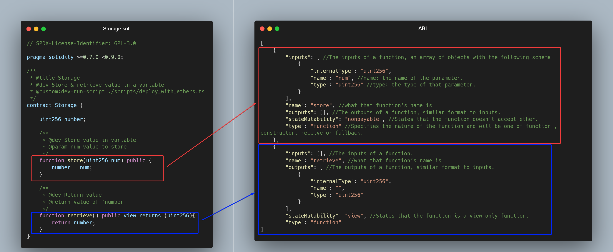

# HW3 Solution
Using Remix
Open [Remix IDE](https://remix.ethereum.org)\
Use the [simple storage contract](https://gist.github.com/extropyCoder/c0210a05d2e122c63bbe25d2477f95cd)\
Compiling the provided simple storage contract.\
we get the following ABI
```json
[
	{
		"inputs": [
			{
				"internalType": "uint256",
				"name": "num",
				"type": "uint256"
			}
		],
		"name": "store",
		"outputs": [],
		"stateMutability": "nonpayable",
		"type": "function"
	},
	{
		"inputs": [],
		"name": "retrieve",
		"outputs": [
			{
				"internalType": "uint256",
				"name": "",
				"type": "uint256"
			}
		],
		"stateMutability": "view",
		"type": "function"
	}
]
```
Have a look at the abi and the bytecode, do you understand how the abi relates to your contract's code?\
The Application Binary Interface (ABI) of a smart contract gives a contract the ability to communicate and interact with external applications and other smart contracts. Receiving data from external sources can be critical for completing the goals of the application and the user.\
Like its Web2 cousin, the API, ABI acts as a function selector, defining the specific methods that can be called to a smart contract for execution. These specific methods and their connected data types are listed in a generated JSON RPC file. 



